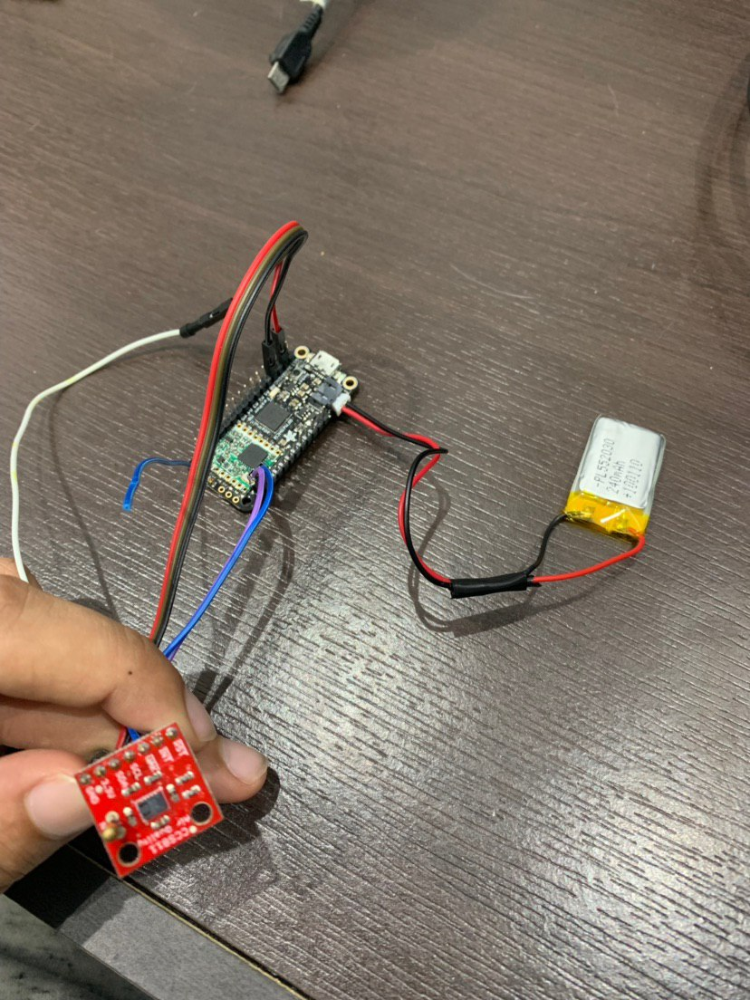
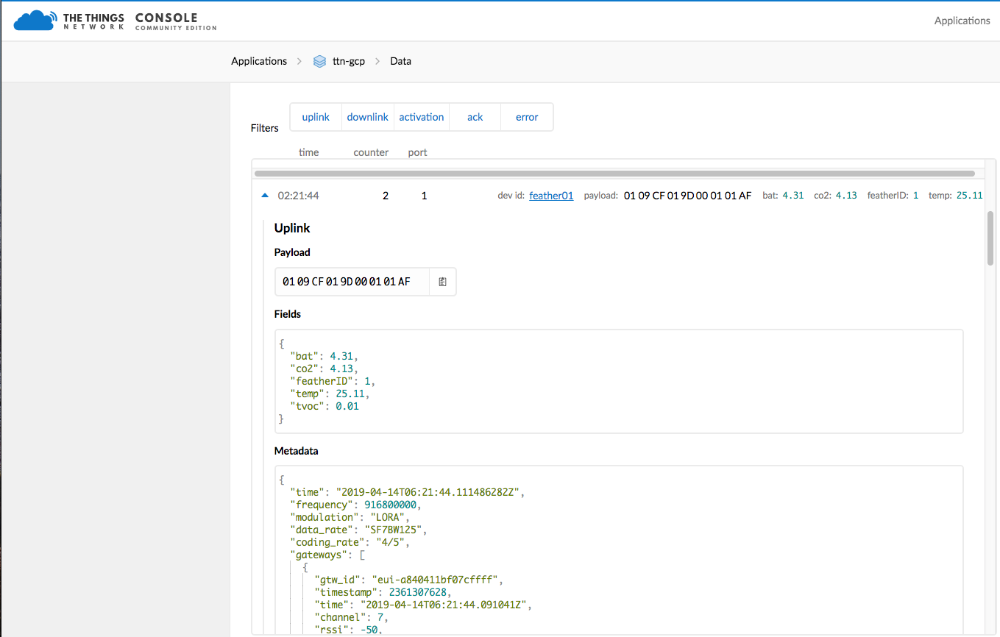
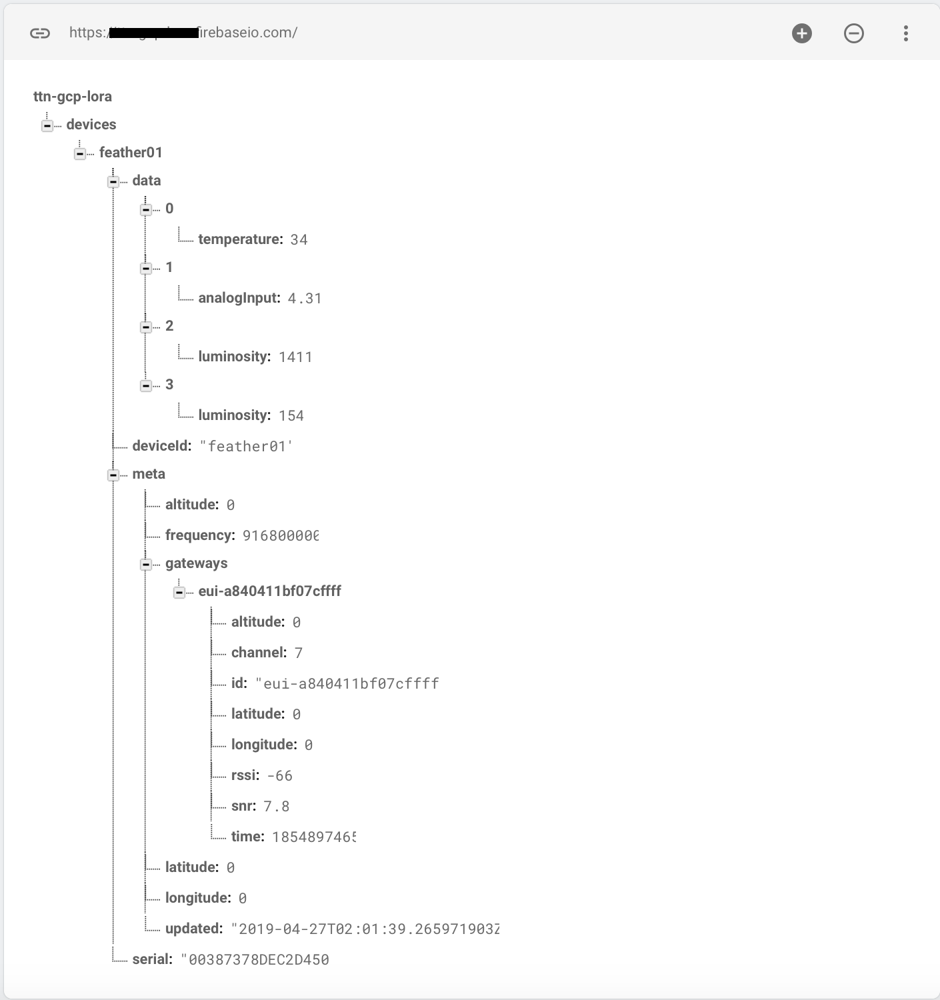
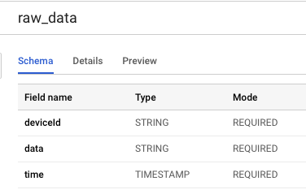
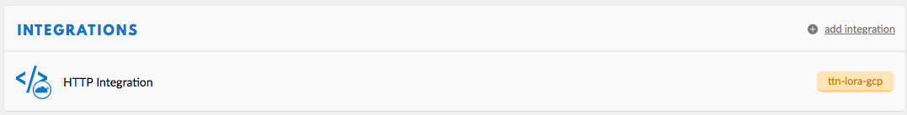
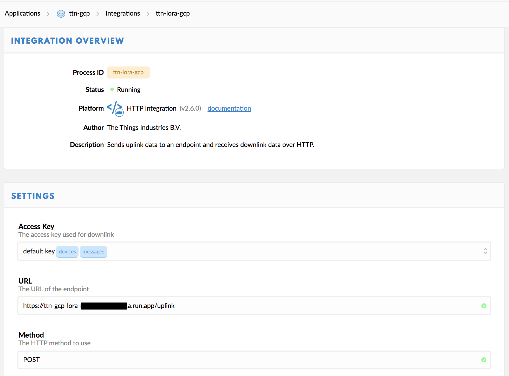

# The Things Network Integration with Google Cloud

Process uplink messages from TTN on Google Cloud, storing Realtime data on Firebase, historical data on BigQuery and visualize the data though a web app.

**THIS IS A WORK IN PROGRESS**

LoRa End Node:


Data arriving on The Things Network:


Data on Firebase:


## BOM - Bill of Materials

### Gateway 
* Dragino LP01-S - Single Channel LoRa Gateway
  * Connected to The Things Network - [Connect to TTN - Wiki for Dragino Project](https://wiki.dragino.com/index.php?title=Connect_to_TTN)

### LoRa End Node

* Feather M0 LoRa 915mhz - [Link](https://www.adafruit.com/product/3178) 
* CCS811 Air Quality Sensor - [Link](https://learn.sparkfun.com/tutorials/ccs811-air-quality-breakout-hookup-guide?_ga=2.196632293.895409039.1555180411-1431402083.1549724810)
* 240mah battery

#### Upload firmware with PlatfomIO

I recommend installing the Visual Studio Code (VSCode) IDE and the PlatformIO plugin to get started using it. Just follow the step on the link below: 

https://platformio.org/platformio-ide

To deploy to the board, just open the `firmware` folder and you can use the “Build” and “Upload” buttons on PlatformIO Toolbar. All libraries and dependencies will be downloaded.

*TODO: Add wiring*

## Google Cloud Setup

* Install gcloud CLI - [Link](https://cloud.google.com/sdk/install)
* Authenticate with Google Cloud:
    * `gcloud auth login`
* Create cloud project — choose your unique project name:
    * `gcloud projects create YOUR_PROJECT_NAME`
* Set current project
    * `gcloud config set project YOUR_PROJECT_NAME`
* Associate with a Firebase Project - [Link](https://console.firebase.google.com/)
* Create a Table on BigQuery - [Link](https://console.cloud.google.com/bigquery)
  * Create a Dataset with name `ttn_dataset` 
  * Create a table with name `raw_data` and fields `deviceId (string)`, `data(string)` and `time (Timestamp)`



#### Deploy Cloud Function

This step will deploy a HTTP Cloud Function made with Golang. I made a script `deploy.sh` that is on the `functions` folder, that you can use to do that.

* Run on the command line:
```
cd functions
./deploy.sh
```

After deploying the cloud function, you can get it's url that will look like `https://{project-region}-{project-id}.cloudfunctions.net/HandleTTNUplink`.

## The Things Network Setup

* Create a new application
* Create a new integration of type HTTP
  * Use the url of the cloud function created on the last step.




**Work in Progress**

## References
* https://learn.adafruit.com/using-lorawan-and-the-things-network-with-circuitpython?view=all
* https://www.thethingsnetwork.org/docs/applications/http/#uplink
